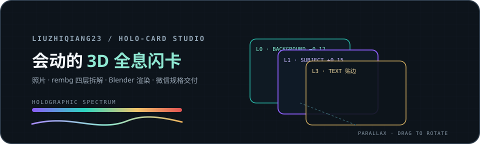
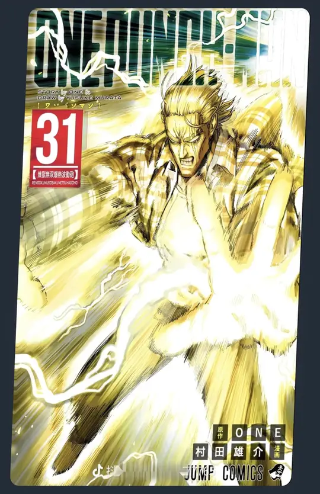

  

  

  

  👆 会动的 3D 全息闪卡 · 照片/立绘 → 四层拆解 → Blender 240 帧渲染 → 微信可直接发的 GIF/MP4 ·
  <a href="https://github.com/zai-org/zcode-plugins/pull/21">已打包上架 ZCode 插件市场（PR #21）</a> ·
  <a href="https://github.com/HRuiCcc/RuiC-card-skill/pull/7">回传上游的修复 PR #7</a>

---

# 你好,我是 liuzhiqiang23 👋

>  AI / LLM 应用探索 | 自托管玩家

- 🔭 正在做:**PentAGI 多智能体系统部署实战笔记**(中文教程向,持续更新) + **全息闪卡照片流水线**(rembg 抠图 · Blender 渲染 · 微信规格压制)
- 🌱 正在学:HarmonyOS 应用开发(ArkTS/DevEco) · LLM 应用开发 · CTF 安全基础
- 🛠 常用:`Python` `JavaScript` `HTML` `Docker` `Git`
- 📦 同步维护 [Gitee 镜像](https://gitee.com/liu-zhiqiang20030520)
- ✍️ 技术文章:[知乎 @义不艮将](https://www.zhihu.com/people/yi-bu-gen-jiang) | 掘金 @liuzhiqiang23

## 📌 精选仓库

| 仓库 | 说明 |
|------|------|
| [pentagi--AI--notes](https://github.com/liuzhiqiang23/pentagi--AI--notes) | PentAGI 多智能体系统部署实战笔记(中文) |
| [RuiC-card-skill](https://github.com/liuzhiqiang23/RuiC-card-skill) | 全息闪卡技能(fork 自 [HRuiCcc](https://github.com/HRuiCcc/RuiC-card-skill),MIT;ZCode 插件打包见 PR #21) |
| [chuanmeishujuguanlixitong](https://github.com/liuzhiqiang23/chuanmeishujuguanlixitong) | 传媒数据管理系统(课程项目) |
| [artificial-intelligent-created-system](https://github.com/liuzhiqiang23/artificial-intelligent-created-system) | AI 内容创建系统(课程项目) |

## 📊 统计

## 🐍 贡献贪吃蛇

<picture>
  <source media="(prefers-color-scheme: dark)" srcset="https://raw.githubusercontent.com/liuzhiqiang23/liuzhiqiang23/output/github-contribution-grid-snake-dark.svg" />
  <source media="(prefers-color-scheme: light)" srcset="https://raw.githubusercontent.com/liuzhiqiang23/liuzhiqiang23/output/github-contribution-grid-snake.svg" />
  
</picture>

## 🏆 连击 / 奖杯

  <picture>
    <source media="(prefers-color-scheme: dark)" srcset="assets/streak-dark.svg" />
    <source media="(prefers-color-scheme: light)" srcset="assets/streak-light.svg" />
    
  </picture>

  <picture>
    <source media="(prefers-color-scheme: dark)" srcset="assets/trophy-dark.svg" />
    <source media="(prefers-color-scheme: light)" srcset="assets/trophy-light.svg" />
    
  </picture>

## ☕ 赞赏

  
  
这些笔记与工具如果帮到了你,微信扫码请杯咖啡 ☕

