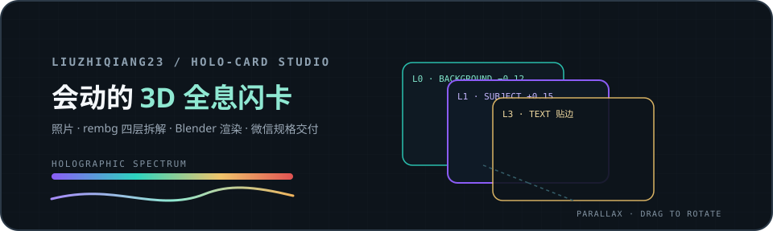
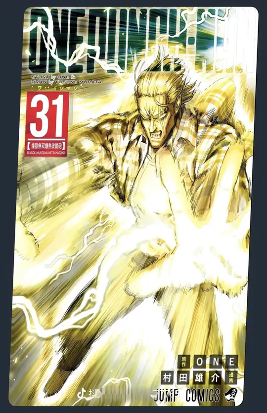
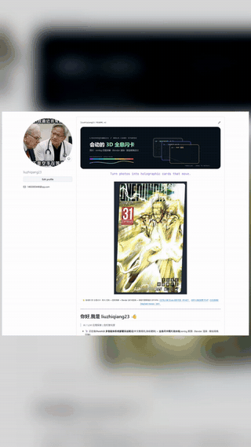

<a href="https://liuzhiqiang23.github.io/"><b>🌐 我的个人网站：liuzhiqiang23.github.io</b></a>

  

  

  

  

  👆 会动的 3D 全息闪卡 · 照片/立绘 → 四层拆解 → Blender 240 帧渲染 → 微信可直接发的 GIF/MP4 ·
  <a href="https://github.com/zai-org/zcode-plugins/pull/21">已打包上架 ZCode 插件市场（PR #21）</a> ·
  <a href="https://github.com/HRuiCcc/RuiC-card-skill/pull/7">回传上游的修复 PR #7</a> ·
  <a href="https://github.com/liuzhiqiang23/RuiC-card-skill#安装到-deepseek-harnessdsh">已实测适配 DeepSeek Harness（dsh）</a>

---

# 你好,我是 liuzhiqiang23 👋

>  AI / LLM 应用探索 | 自托管玩家

- 🔭 正在做:**PentAGI 多智能体系统部署实战笔记**(中文教程向,持续更新) + **全息闪卡照片流水线**(rembg 抠图 · Blender 渲染 · 微信规格压制)
- 🌱 正在学:HarmonyOS 应用开发(ArkTS/DevEco) · LLM 应用开发 · CTF 安全基础
- 🛠 常用:`Python` `JavaScript` `HTML` `Docker` `Git`
- 📦 同步维护 [Gitee 镜像](https://gitee.com/liu-zhiqiang20030520)
- ✍️ 技术文章:[知乎 @义不艮将](https://www.zhihu.com/people/yi-bu-gen-jiang) | 掘金 @liuzhiqiang23

## 🎮 精选游戏：《重生之我在方块位面当光之巨人》

> **3D 体素沙盒生存游戏** —— 类我的世界方块世界 × 变身光之巨人打怪兽
> **零外部素材**：贴图、角色、怪兽、音效全部由代码程序化生成

### ▶ 在线试玩（电脑浏览器打开即玩，无需安装）

# **[liuzhiqiang23.github.io/light-giant](https://liuzhiqiang23.github.io/light-giant/)**

  
  

**✨ 亮点**：512×512 多生物群系世界（草原/沙漠/密林/雪山/天堂岛）· 巨人战斗系统（能量炮弹/蓄力激光/锁定飞踢/三连拳击/巨大化）· 昼夜玩法循环（白天建造、夜晚守卫神殿、黎明战损复原）· 全程序化音效 · 89 万方块实例 60fps

**📦 源码**：[GitHub](https://github.com/liuzhiqiang23/light-giant) · [Gitee 镜像](https://gitee.com/liu-zhiqiang20030520/light-giant) · 仓库内含微信小游戏移植版（minigame/）

---

## 🎬 我的作品集视频（AI 全自动剪辑）

  

  👆 预览（前 10 秒）· <a href="assets/gh-reel.mp4">▶️ 观看完整版 1080×1920 / 24.6s</a> ·
  由 AI 代理从截图采集 → ffmpeg 画布 → 剪映草稿 → 导出全流程自动完成 ·
  <a href="https://zhuanlan.zhihu.com/p/2086965296661784206">制作全流程拆解（知乎）</a>

## 📌 精选仓库

| 仓库 | 说明 |
|------|------|
| [light-giant](https://github.com/liuzhiqiang23/light-giant) | 🎮 **3D 体素沙盒游戏《光之巨人》**——[在线试玩](https://liuzhiqiang23.github.io/light-giant/)，零素材全程序化，含微信小游戏版 |
| [pentagi--AI--notes](https://github.com/liuzhiqiang23/pentagi--AI--notes) | PentAGI 多智能体系统部署实战笔记(中文) |
| [RuiC-card-skill](https://github.com/liuzhiqiang23/RuiC-card-skill) | 全息闪卡技能(fork 自 [HRuiCcc](https://github.com/HRuiCcc/RuiC-card-skill),MIT;ZCode 插件打包见 PR #21,已实测适配 [DeepSeek Harness](https://github.com/deepseek-ai/deepseek-harness)) |
| [chuanmeishujuguanlixitong](https://github.com/liuzhiqiang23/chuanmeishujuguanlixitong) | 传媒数据管理系统(课程项目) |
| [artificial-intelligent-created-system](https://github.com/liuzhiqiang23/artificial-intelligent-created-system) | AI 内容创建系统(课程项目) |

## 🐍 贡献贪吃蛇

<picture>
  <source media="(prefers-color-scheme: dark)" srcset="https://raw.githubusercontent.com/liuzhiqiang23/liuzhiqiang23/output/github-contribution-grid-snake-dark.svg" />
  <source media="(prefers-color-scheme: light)" srcset="https://raw.githubusercontent.com/liuzhiqiang23/liuzhiqiang23/output/github-contribution-grid-snake.svg" />
  
</picture>

## 🏆 连击 / 奖杯

  <picture>
    <source media="(prefers-color-scheme: dark)" srcset="assets/streak-dark.svg" />
    <source media="(prefers-color-scheme: light)" srcset="assets/streak-light.svg" />
    
  </picture>

  <picture>
    <source media="(prefers-color-scheme: dark)" srcset="assets/trophy-dark.svg" />
    <source media="(prefers-color-scheme: light)" srcset="assets/trophy-light.svg" />
    
  </picture>

## ☕ 赞赏

  
  
这些笔记与工具如果帮到了你,微信扫码请杯咖啡 ☕

---

## 🎓 毕业设计 · 历代诗人知识图谱问答系统（Poet-KGQA）

> 把《全唐诗》读"厚"：57,607 首诗建图 · Neo4j + FAISS 双轨检索 · BERT NER 消歧 · DeepSeek 证据化生成 · 水墨风三页界面

  &nbsp;
  &nbsp;
  

- 🖥 **在线展示**：[liuzhiqiang23.github.io/poet-kgqa](https://liuzhiqiang23.github.io/poet-kgqa/) —— 三页界面截图、功能与实验结果
- 🧪 图谱约束使回答一致性 **66% → 100%**（n=100）；检索消融 **80.0% vs 13.3%**（hit@3）
- 📜 全唐诗 57,607 首 / 诗人 3,662 位 / 交游边 138 条全部人工复核
